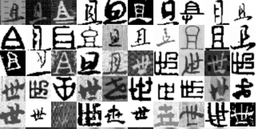

## Introduction

A Tensorflow implementation of CapsNet based on Geoffrey Hinton's paper [Dynamic Routing Between Capsules](https://arxiv.org/abs/1710.09829)

The code was derive from  [naturomics/CapsNet-Tensorflow](https://github.com/naturomics/CapsNet-Tensorflow)
. 
To apply to the Chinese Character Recognization competions(中国古汉字识别,或者成为书法识别比赛)，I made some improvements.

1. The parameters of original code edition are fixed, it is troublesome to change the conv layer's kernel size. Now you can set it casual.
2. To improve the accuracy of Chinese Character, I add a more conv layer ,the shape of input_image is 64\*64*1 


> **Notes:**
> 1. The current version supports [中国书法识别](http://yann.lecun.com/exdb/mnist/)  The current test accuracy for MNIST is `93.42%`
> 2. See [dist_version](dist_version) for multi-GPU support


## Requirements
- Python
- NumPy
- [Tensorflow](https://github.com/tensorflow/tensorflow)>=1.3
- tqdm (for displaying training progress info)
- scipy (for saving images)

## Usage
**Step 1.** Download this repository with ``git`` 

```
$ git clone git@github.com:mixianbuguoqiao/CapsNet-Character-Tensorflow.git
$ cd CapsNet-Tensorflow
```

**Step 2.** Download [Chinese-Character](https://pan.baidu.com/s/1MmrpTfQKN08-4hzvCEiuig) 

 Manual downloading with `wget` or other tools, move and extract dataset into ``data``  for example:

```
$ mkdir -p data

```

**Step 3.** Start the training(Using the MNIST dataset by default):

```
$ python main.py

$ or python main.py --dataset character
$ # If you need to monitor the training process, open tensorboard with this command
$ tensorboard --logdir=logdir

```

**Step 4.** Calculate test accuracy

```
$ python main.py --is_training=False
$ # for fashion-mnist dataset
$ python main.py --dataset fashion-mnist --is_training=False
```

> **Note:** The default parameters of batch size is 1, and epoch 50. You may need to modify the ``config.py`` file or use command line parameters to suit your case, e.g. set batch size to 32 and do once test summary every 200 steps: ``python main.py  --test_sum_freq=100 --batch_size=32``


### Reference
- [naturomics/CapsNet-Tensorflow](https://github.com/naturomics/CapsNet-Tensorflow): referred for some code optimizations
